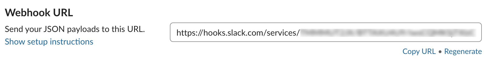
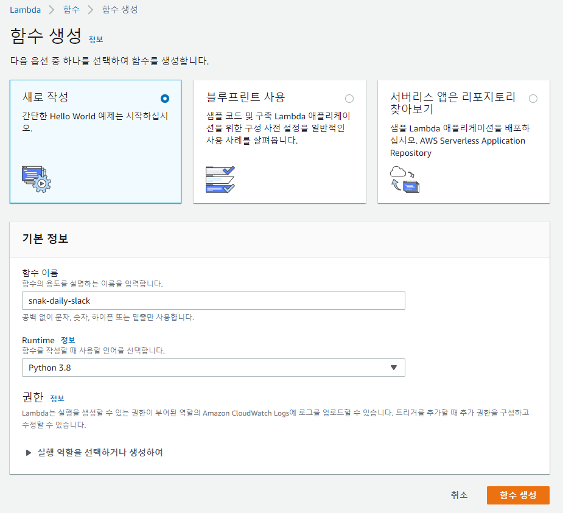
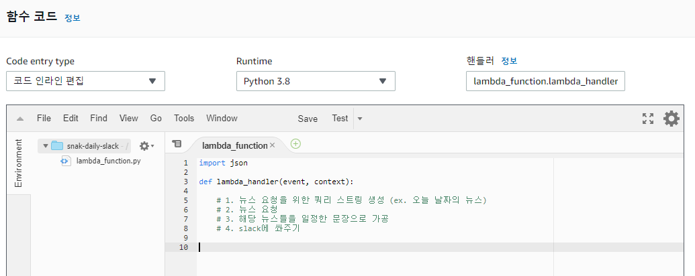
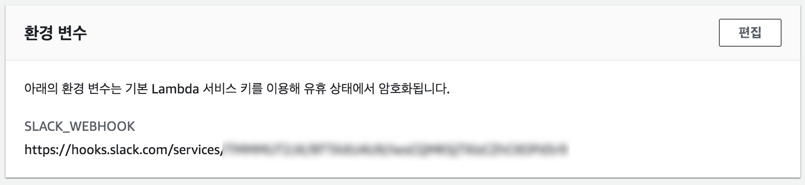
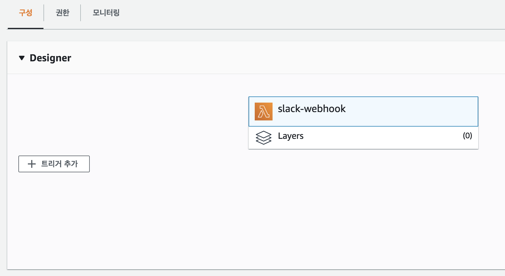
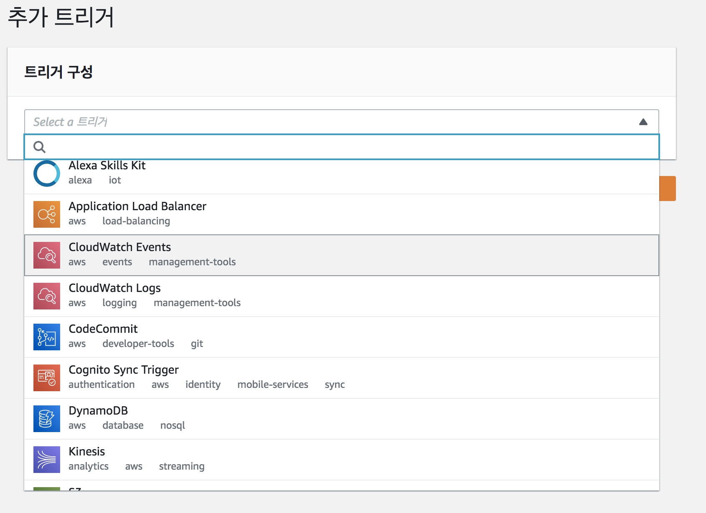
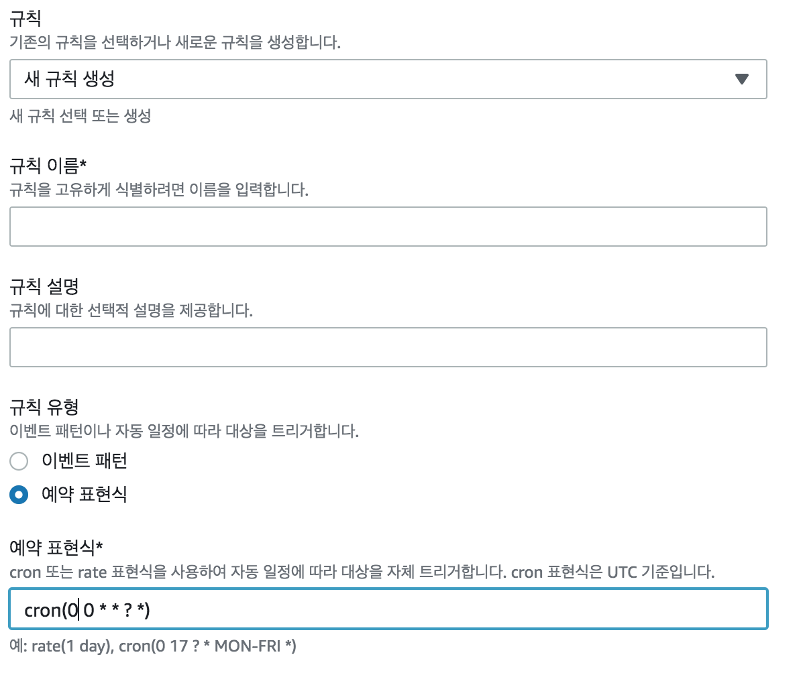
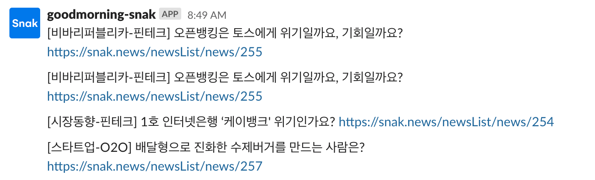

# snak-webhook
- Code based on https://github.com/Koomook/snak-slack

# What to do
- 일정 시간마다 특정 Slack 채널에 하루 분량의 기사 보여주기

# Overview

# Index
(순서 무관)
- Slack에서 [Incoming Webhooks](https://delf-test.slack.com/apps/A0F7XDUAZ-incoming-webhooks?next_id=0) app 설치
- AWS Lambda 설정
- Triger 설정
  - 특정 시간: CloudWatch Event 설정
  - ~~명령어: AWS API Gateway + Slcak custom app~~ (미구현)

# 과정
## Slack에서 Incoming Webhooks app 설치
https://delf-test.slack.com/apps/A0F7XDUAZ-incoming-webhooks?next_id=0

- 설정에서 Webhook URL 조회 가능

 - 참고) 이름과 이미지 설정 가능

## AWS Lambda 설정
- 함수 생성

- 코드 작성
  - 코드는 본 github 파일 참조
  - 조회 할 뉴스, 뉴스 기사 출력 포맷 제어 가능

  
- 참고) 여기에서 Webhook URL 사용
  - 환경변수에서 등록 후
  - 위 함수 코드에서 호출

## Triger 설정
- CloudWatch Event로 시간 트리거 설정

- 예약식 관련 문서: https://docs.aws.amazon.com/ko_kr/lambda/latest/dg/tutorial-scheduled-events-schedule-expressions.html
- 주의) 시간은 UTC 기준
  - 참고) 현재 UTC 시간 https://time.is/ko/UTC

- 참고) 해당 예약 표현식은 매일 오전 9시 기준

# Result

